# PartFlow — Project Flow Guide

Web ERP rebuilt from the legacy IAAPCO desktop system. This document explains how the PartFlow site works: architecture, user access, module flows, and key business processes.

**Project path:** `/opt/lampp/htdocs/iaapco-erp`  
**App name:** PartFlow (`APP_NAME=PartFlow` in `.env`)  
**Database:** MySQL `iaapco_erp`  
**Default login:** `admin@gmail.com` / `password`

---

## 1. High-level architecture

```
Browser (Blade + Tailwind + Alpine.js)
        │
        ▼
Laravel 11 Routes (web.php + auth.php)
        │
        ├── Middleware: auth → verified → erp.permission
        │
        ▼
Controllers (HTTP layer)
        │
        ▼
Services (business logic)
        │
        ▼
Models + MySQL
```

| Layer | Role |
|-------|------|
| **Routes** | URL → controller action; all ERP routes under auth middleware |
| **Controllers** | Validate input, call services, return views/redirects/PDFs |
| **Services** | Stock, sales, purchase, accounting, HR, POS, transport, etc. |
| **Models** | Eloquent entities (parts, invoices, employees, …) |
| **Views** | Blade templates; ERP sidebar layout; EN/AR via `__()` |
| **Reports** | `ReportService` + `config/reports.php` + PDF via DomPDF |

---

## 2. Request & security flow

Every protected page follows this path:

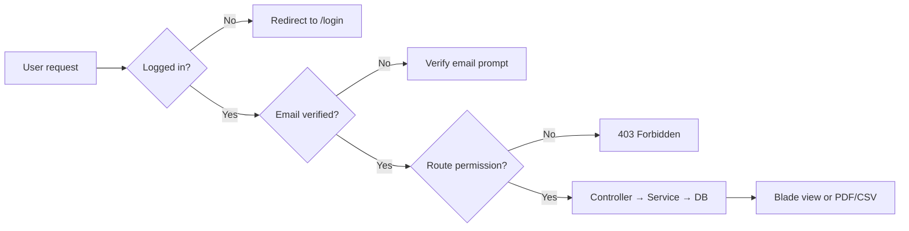

### Roles (`config/erp.php`)

| Role | Access |
|------|--------|
| **admin** | Full access (`*`) |
| **manager** | Most modules: inventory, sales, purchase, finance, HR, reports, settings |
| **sales** | Sales, customers, POS, quotations, showroom, transport |
| **warehouse** | Parts, stock, purchase, transfers, stock counts |
| **user** | Dashboard only |

Granular permissions (e.g. `sales.edit_posted`, `sales.void`) are managed per user in **Users & Roles** (`/users`).

### Locale

- Toggle EN/AR from the header (`POST /locale/{en|ar}`)
- RTL layout applied when Arabic is active
- Translations in `lang/en/` and `lang/ar/`

---

## 3. Site map (modules)

Navigation is defined in `resources/views/layouts/erp.blade.php`.

| Section | Main routes | Purpose |
|---------|-------------|---------|
| **Dashboard** | `/dashboard` | KPIs, charts, quick links |
| **Inventory** | `/parts`, `/stock`, `/stock-batches`, `/stock/movements`, `/stock-transfers` | Parts master, balances, movements, transfers |
| **Sales** | `/quotations`, `/proforma-invoices`, `/sales-invoices`, `/sale-returns`, `/delivery-notes`, `/pick-tickets`, `/pos`, `/customers` | Quote → sell → deliver → return |
| **Transport** | `/transport/shipments`, `/transport/shipping-status`, `/transport/cash-vouchers`, `/transport-drivers` | Shipping & driver cash |
| **Purchase** | `/purchase-orders`, `/purchase-invoices`, `/purchase-returns`, `/vendors` | Buy parts, receive stock |
| **Inventory ops** | `/stock-counts` | Physical inventory count |
| **Reports** | `/reports` | 160+ legacy-style reports (web + PDF + CSV) |
| **Finance** | `/accounts`, `/journal-entries`, `/payments`, `/cash-book`, `/cheques`, `/fixed-assets`, `/currencies`, `/finance/periods`, `/finance/reports` | GL, AR/AP, cash, assets |
| **Workshop** | `/job-cards`, `/vehicles`, `/vehicle-orders`, `/workshop/reports/wip` | Service jobs & vehicles |
| **HR** | `/employees`, `/departments`, `/attendance`, `/leave`, `/payroll`, `/public-holidays` | People & payroll |
| **Masters** | `/branches`, `/locations`, `/brands`, `/origins`, `/franchises`, `/units` | Organization & catalog setup |
| **System** (admin) | `/settings`, `/settings/legacy-import`, `/users`, `/audit-logs` | Config, migration, users |

---

## 4. Core business flows

### 4.1 Master data setup (first-time)

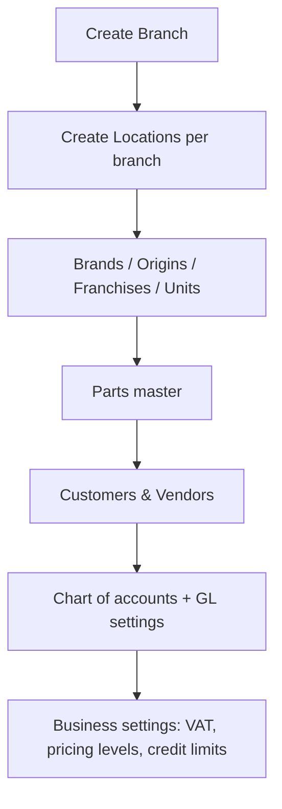

**Where:** Masters sidebar + **Settings** (`/settings`)

---

### 4.2 Purchase flow (stock in)

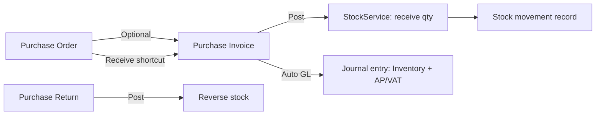

| Step | Route | Service |
|------|-------|---------|
| Create PO | `POST /purchase-orders` | `PurchaseService` |
| Receive PO | `POST /purchase-orders/{id}/receive` | Creates PI + receives stock |
| Create PI | `POST /purchase-invoices` | `PurchaseService` |
| Post PI | `POST /purchase-invoices/{id}/post` | Stock in + optional GL |
| Return | `POST /purchase-returns` → post | Stock out reversal |

---

### 4.3 Sales flow (stock out)

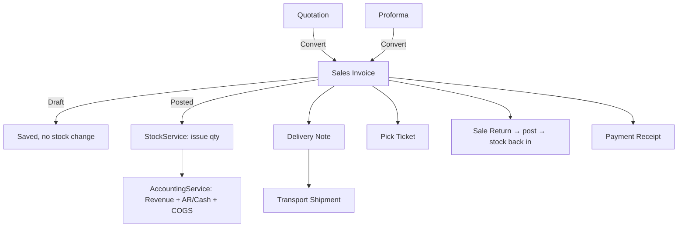

| Step | Route | Service |
|------|-------|---------|
| Quotation | `/quotations/create` | `SalesService::createQuotation` |
| Convert to invoice | `POST /quotations/{id}/convert` | `SalesService::convertQuotationToInvoice` |
| Sales invoice | `/sales-invoices/create` | `SalesService::createInvoice` |
| Post invoice | `POST /sales-invoices/{id}/post` | Deduct stock + GL |
| Void invoice | `POST /sales-invoices/{id}/void` | Reversal (permission required) |
| Sale return | `/sale-returns/create` → post | `SalesService` + stock return |

**Pricing:** `PricingService` resolves price level (retail/wholesale/corporate) from customer type + discount rules in settings.

**Credit:** `CreditService` can block credit sales over limit when enabled in settings.

---

### 4.4 POS flow

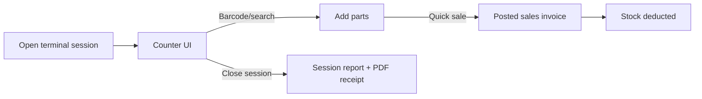

| Step | Route |
|------|-------|
| Terminals list | `GET /pos` |
| Open session | `POST /pos/terminals/{terminal}/open-session` |
| Counter | `GET /pos/sessions/{session}` |
| Search parts | `GET /pos/sessions/{session}/search-parts` |
| Quick sale | `POST /pos/sessions/{session}/sale` |
| Close | `POST /pos/sessions/{session}/close` |

Service: `PosService`

---

### 4.5 Inventory operations

| Operation | Flow | Service |
|-----------|------|---------|
| **View stock** | `/stock` — balances by branch/location/part | `StockService` |
| **Movements** | `/stock/movements` — audit trail | Auto on post/transfer/adjust |
| **Adjustment** | `/stock/adjustment` — manual +/- qty | `StockService::adjust` |
| **Transfer** | Create → complete | Out from branch A, in to branch B |
| **Physical count** | Create count → enter variances → post | `StockCountService` |
| **Batches** | `/stock-batches` — batch/serial tracked parts | `BatchStockService` |

Stock is keyed by: **branch + location + part** (`stock_balances` table).

---

### 4.6 Finance & accounting flow

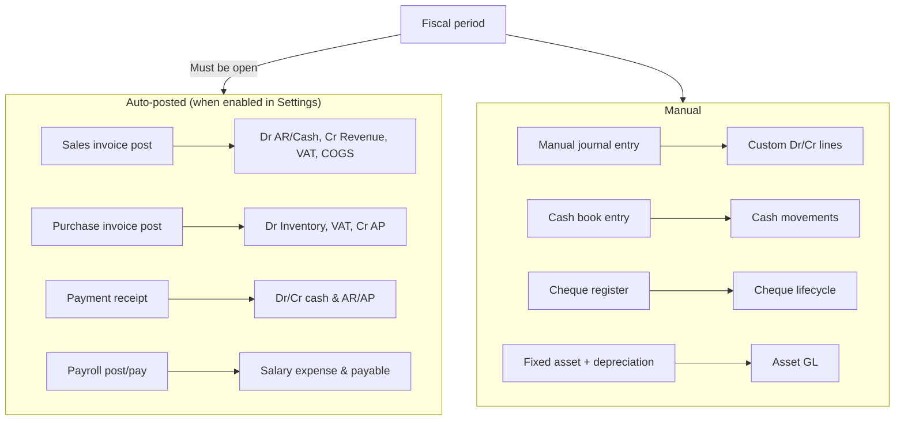

| Component | Route | Service |
|-----------|-------|---------|
| Chart of accounts | `/accounts` | CRUD |
| Journal entries | `/journal-entries` | `AccountingService::postEntry` |
| Payments | `/payments` | `PaymentService` |
| Customer/vendor statement | `/customers/{id}/statement` | AR/AP aging |
| Fiscal periods | `/finance/periods` | Open/close month |
| Finance reports | `/finance/reports/*` | Trial balance, P&L, balance sheet, aging |
| GL mapping | `/settings` (GL section) | Account codes for auto-post |

---

### 4.7 Workshop flow

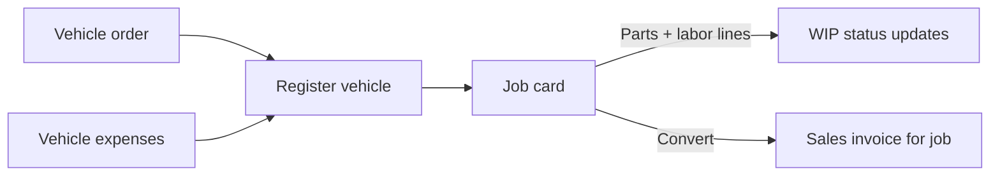

| Item | Route | Service |
|------|-------|---------|
| Vehicles | `/vehicles` | CRUD |
| Job cards | `/job-cards` | `WorkshopService` |
| WIP report | `/workshop/reports/wip` | Open jobs by status/mechanic |

---

### 4.8 HR & payroll flow

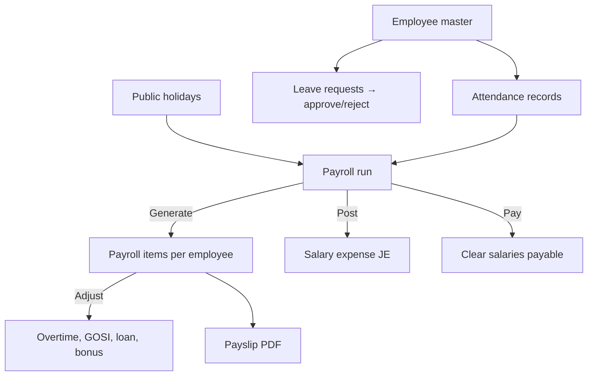

| Step | Route | Service |
|------|-------|---------|
| Employees | `/employees` | CRUD + profile |
| Attendance | `/attendance` | Daily in/out |
| Leave | `/leave` | Request workflow |
| Payroll run | `/payroll/create` → show → post → pay | `HrService` |
| Expiring docs | `/hr/reports/expiring-documents` | Aqama, license, istimara |

---

### 4.9 Transport & delivery flow

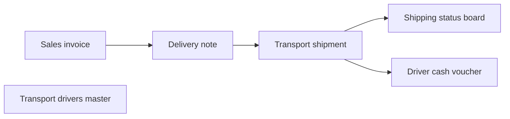

Routes under `/transport/*` and `/delivery-notes`.

Service: `TransportService`

---

### 4.10 Showroom vehicles flow

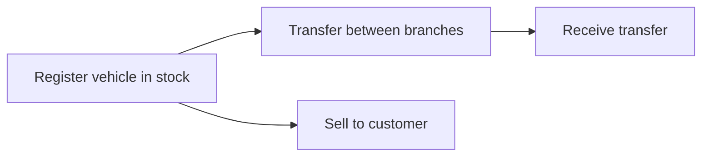

Routes: `/showroom-vehicles/*`  
Service: `ShowroomVehicleService`

---

### 4.11 Legacy data migration flow

For importing historical data from desktop SQL Server (`InventoryHas` on `JS-SERVER`):

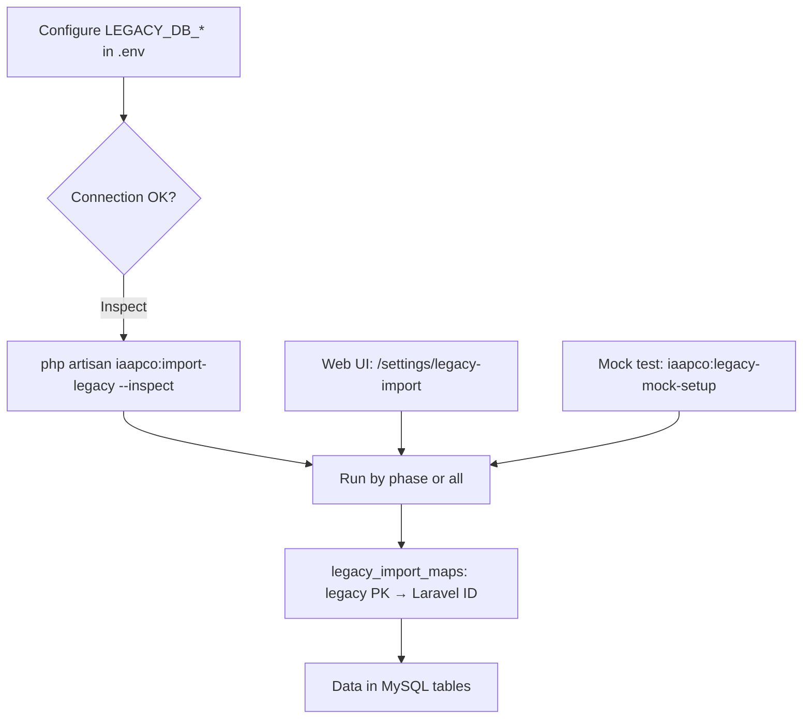

**Phases (dependency order):**

1. `organization` — branches, departments, locations  
2. `masters` — brands, origins, franchises, units, parts, customers, vendors, accounts  
3. `inventory` — stock balances, movements, transfers  
4. `sales` — quotations, sales invoices, sale returns  
5. `purchase` — purchase orders, purchase invoices  
6. `finance` — journal entries, payment receipts  
7. `workshop` — vehicles, job cards  
8. `hr` — employees  

**CLI commands:**

```bash
# Inspect column mappings
php artisan iaapco:import-legacy --inspect

# Full import (production SQL Server)
php artisan iaapco:import-legacy --connection=legacy_sqlsrv --phase=all --force

# Local mock test (no SQL Server required)
php artisan iaapco:legacy-mock-setup --fresh
php artisan iaapco:import-legacy --connection=legacy_sqlite --phase=all --fresh-maps --force
```

Config: `config/legacy_import.php`  
Web UI: **Settings → Legacy Data Import** (`/settings/legacy-import`)

---

## 5. Reports & documents flow

### Reports center (`/reports`)

1. User picks report from categorized list  
2. Applies filters (date range, branch, customer, etc.)  
3. Views on screen, exports **PDF** or **CSV**

Reports map to legacy Crystal names via `config/reports.php` and `config/reports_extended.php`.  
Handler logic lives in `ReportService`.

### Document PDFs (`DocumentController`)

| Document | Route |
|----------|-------|
| Sales invoice | `/documents/sales-invoices/{id}/pdf` |
| Purchase invoice | `/documents/purchase-invoices/{id}/pdf` |
| Quotation | `/documents/quotations/{id}/pdf` |
| Delivery note | `/documents/delivery-notes/{id}/pdf` |
| Payment receipt | `/documents/payment-receipts/{id}/pdf` |
| Payslip | `/documents/payroll/{run}/items/{item}/pdf` |
| Part label/barcode | `/documents/parts/{id}/label` |
| Master lists | `/documents/masters/{customers\|vendors\|parts}/pdf` |

PDF layout uses Crystal-style partials in `resources/views/reports/pdf/`.

---

## 6. Key services reference

| Service | Responsibility |
|---------|----------------|
| `StockService` | Balances, issue, receive, transfer, adjustments |
| `SalesService` | Quotations, invoices, returns, posting |
| `PurchaseService` | PO, PI, returns, receiving |
| `AccountingService` | GL auto-post, journal entries, reversals |
| `PaymentService` | Customer/vendor receipts |
| `PricingService` | Price levels & discount rules |
| `TaxService` | VAT calculation |
| `CreditService` | Credit limit enforcement |
| `FiscalPeriodService` | Period open/close guards |
| `HrService` | Payroll generate, post, pay, GOSI |
| `PosService` | POS sessions & quick sales |
| `TransportService` | Shipments, vouchers, status |
| `ShowroomVehicleService` | Showroom vehicle stock, transfer, sell |
| `ReportService` | All analytical reports |
| `LegacyImportService` | Desktop DB migration |
| `PermissionService` | Role & route access |
| `AuditService` | Audit log writes |
| `SettingService` | Company & GL settings |

---

## 7. Database structure (migration groups)

| Migration file prefix | Tables (summary) |
|-----------------------|------------------|
| `100001` Organization | `branches`, `departments`, `employees`, users |
| `100002` Master data | `brands`, `origins`, `franchises`, `units`, `locations` |
| `100003` Parts | `parts`, kits, alternatives |
| `100004` Parties | `customers`, `vendors` |
| `100005` Inventory | `stock_balances`, `stock_movements`, `stock_transfers` |
| `100006` Sales | `quotations`, `sales_invoices`, `sale_returns`, delivery, pick tickets |
| `100007` Purchase | `purchase_orders`, `purchase_invoices`, `purchase_returns` |
| `100008` Accounting | `accounts`, `journal_entries`, `payment_receipts`, cheques, cash book |
| `100009` Workshop | `vehicles`, `job_cards`, vehicle orders/expenses |
| `100011` HR extensions | attendance, leave, payroll |
| `100016` Transport | shipments, drivers, cash vouchers |
| `100015` Showroom | showroom vehicles, models, colors, transfers |
| `100019` Legacy import | `legacy_import_maps`, `legacy_import_runs` |

---

## 8. Typical day-in-the-life flows

### Warehouse clerk

1. Receive purchase invoice → stock increases  
2. Pick ticket from sales invoice → confirm pick  
3. Stock transfer to another branch  
4. Run stock / movement reports  

### Sales user

1. Create quotation → convert to invoice  
2. Post invoice (or POS quick sale)  
3. Create delivery note → assign transport shipment  
4. Record customer payment  

### Accountant

1. Review auto-posted journal entries  
2. Run trial balance / aging reports  
3. Close fiscal period  
4. Process cheques & cash book  

### HR officer

1. Record attendance  
2. Approve leave  
3. Generate monthly payroll → post → pay  
4. Print payslips  

### Admin

1. Manage users & permissions  
2. Configure settings & GL accounts  
3. Run legacy import (one-time migration)  
4. Review audit logs  

---

## 9. Local development setup

```bash
cd /opt/lampp/htdocs/iaapco-erp
composer install
cp .env.example .env
php artisan key:generate
php artisan migrate --seed
npm install && npm run build
php artisan serve
```

Open: `http://localhost:8000`

**XAMPP:** point Apache document root or virtual host to `/opt/lampp/htdocs/iaapco-erp/public`.  
Ensure MySQL is running and database `iaapco_erp` exists.

---

## 10. Folder structure (quick reference)

```
iaapco-erp/
├── app/
│   ├── Http/Controllers/       # One controller per module
│   ├── Models/                 # Eloquent models
│   ├── Services/               # Business logic
│   │   └── Legacy/             # Legacy import engine
│   └── Console/Commands/       # iaapco:import-legacy, legacy-mock-setup
├── config/
│   ├── erp.php                 # Roles, GL defaults
│   ├── reports.php             # Report definitions
│   ├── reports_extended.php    # Extended report catalog
│   └── legacy_import.php       # Migration entity map
├── database/migrations/        # Schema
├── docs/
│   └── PARTFLOW-FLOWS.md       # This file
├── lang/en|ar/                 # Translations
├── resources/views/            # Blade UI + PDF templates
└── routes/web.php              # All ERP routes
```

---

## 11. Relationship to legacy desktop IAAPCO

PartFlow is a **web rebuild** of the VB6 + SQL Server + Crystal Reports desktop ERP located at `/opt/lampp/htdocs/haseeb/iaapco`:

| Aspect | Desktop | PartFlow |
|--------|---------|----------|
| UI | Windows VB6 forms | Browser (Blade + Tailwind) |
| Database | SQL Server `InventoryHas` | MySQL `iaapco_erp` |
| Reports | Crystal `.rpt` files | DomPDF Blade templates |
| Data migration | Source system | `iaapco:import-legacy` command + Settings UI |

**Functional parity:** ~85–90% of core ERP operations are implemented. Remaining desktop-only areas include Rough Sheet, VAT dashboard, full showroom module, and pixel-perfect Crystal report layouts.

---

*Last updated: June 2026 — PartFlow / iaapco-erp*
